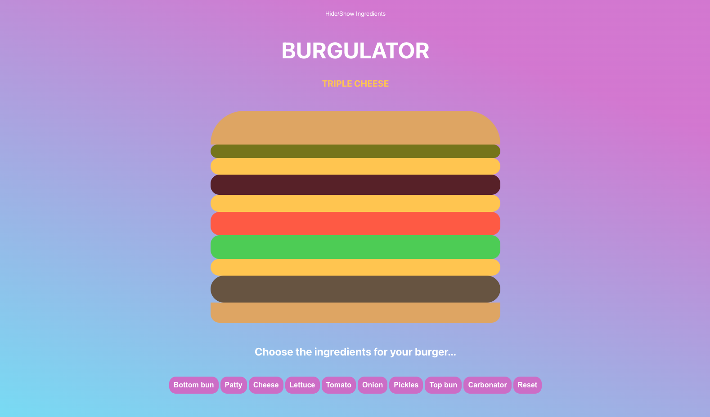

# Burgulator 🍔

First REACT app - build your burger!

Check it out here: https://wendyyzhu.github.io/burgulator/

## Features: 
Choose the ingredients from the list below, and stack it as high as you like! For the cheese lovers 🧀, the APP will show how much cheese you've added e.g. triple cheese for the burger below. Are you a carb lover? Click on the carbonator button for a surprise!😉

If you've messed up and would like to start over, just press the reset button. However, if it's just a few ingredients you'd like to remove, just hover and click on the ingredient in the burger itself! 

Once you're done creating your burger, click on the Hide/Show Ingredients button at the top of the page so you can admire and drool over the burger! 🤤

## Technologies used:
- REACT 
- JavaScript
- HTML
- CSS